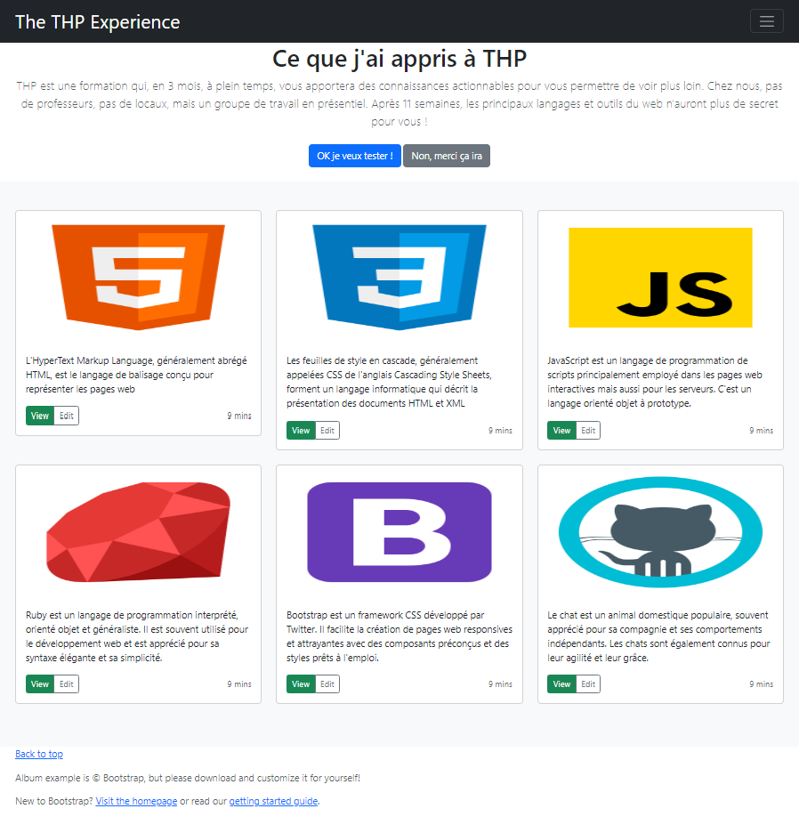

## Reponses aux questions 

### Question 1

Combien y a-t-il d'éléments `
` présents dans la page HTML ?

#### Reponse

Nombre d'élements : 21
 
Comment l'obtenir :  
- `document.getElementsByTagName("p")`

### Question 2

Quel est le contenu texte de l'élément portant l'id coucou ?

#### Reponse

Element trouvé : 2. Historique et contexte (h2)
 
Comment l'obtenir :  
- `document.getElementById('coucou')`

### Question 3

Quelle est l'URL vers laquelle pointe le 3ème élément `<a>` de la page HTML ?

#### Reponse

URL trouvée : https://openclassrooms.com/fr/courses/3306901-creez-des-pages-web-interactives-avec-javascript/3501871-decouvrez-le-dom
 
Comment l'obtenir :  
- `document.getElementsByTagName('a')[2]`

### Question 4

Combien d'éléments portent la classe compte-moi ? 

#### Reponse

Nombre d'éléments : 10
 
Comment l'obtenir :  
- `document.getElementsByClassName('compte-moi')`

### Question 5

Combien d'éléments `<li>` portent la classe compte-moi ?

#### Reponse

Nombre d'éléments : 6
 
Comment l'obtenir :  
- `document.querySelectorAll("li.compte-moi")`

### Question 6

Combien d'éléments `<li>` et situés dans une liste ordonnée portent la classe compte-moi ?

#### Reponse

Nombre d'éléments : 1

Comment l'obtenir :  
- `document.querySelectorAll("ol li.compte-moi")`

### Question 7

La page contient un seul élément `
`. Celui-ci contient 2 éléments "unordered list" ou `<ul>`. Dans le second `<ul>`, le premier élément de la liste (tag `<li>`) est caché visuellement de l'utilisateur mais toi, tu peux en récupérer le contenu. 

#### Reponse

Comment l'obtenir :  
- `document.querySelector("div ul:nth-child(2) li").textContent`

Dans notre script, on peut aussi ajouter un .length pour obtenir le nombre d'élément dans la console, et .href pour obtenir un affichage direct du lien dans la console.

 
J'ai préféré ne pas l'ajouter pour une meilleure vue d'ensemble.

## Aperçu de l'exo 2 (1-5)

  <h1>Enjoy!</h1>
  

